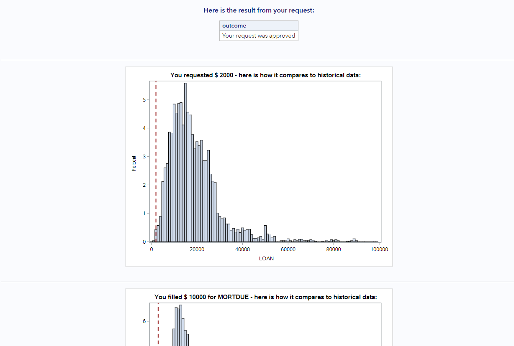

# Loan request application using SAS Job Execution

## Overview

Think about digital transformation. You have a lot of code that you developed that does great calculations, statistics and graphs. How do you put it to be consumed by other? Do you still need to login and run your code every time? 
What if you automate it with APIs or jobs? This repository contains code and a video with step-by-step on how to configure and run a sample SAS Job Execution project from an HTML form.

I also wrote a blog post and you can read it 

## Initial steps

1. Let's start by uploading the data.  
    1. Go to Manage Data and import the HMEQ dataset to the public library. 
2. Go to SAS Studio and run the code jobexec_forest_train.sas  
    1. You should expect to see a table named forest_astore inside the public library.  
3. Go to http://yourserver.com/SASJobExecution  
    1. Create a new folder inside your personal user folder -> usually it is under /Users/yourname  
    2. Inside this folder, right click it and select New File  
        1. Give it a name and select Job Definition as the file type.  
    3. Open the file and paste the contents of jobexec.sas inside it and save.  
    4. Right click the Job Execution file and go to properties -> parameters -> fill out as you see below.  
        
        **Note:** update the _CASHOST_ parameter default value with your SAS server. 
    5. Right click the Job Execution file, go to Edit and select New HTML form.  
    6. Inside the new tab that will popup, paste the contents of the index.html file and save it.  
        1. Do not forget to change the path to match your job execution file:  
        `<input type="hidden" name="_program" value="/Users/ludepa/JES/scoringJob">`
    7. On the Job Execution file, click submit and you should see something like this:  
        
    8. Fill out the blanks and click run code and your output will look like this:  
        

## License

> This project is licensed under the [Apache 2.0 License](LICENSE).
